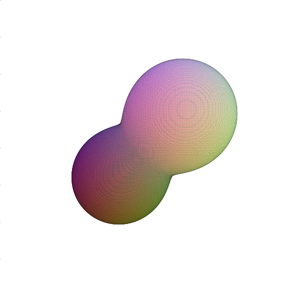

Marching cubes in PyTorch
===

> Marching cubes for PyTorch environment. Backend is implemented with C++ and CUDA.

## Build

```shell
$ python setup.py build_ext -i
```

## Usage

See [mcubes.py](./mcubes.py) for the detail.

```python
import numpy as np
import open3d as o3d

import torch
from mcubes import marching_cubes, grid_interp

# Grid data
N = 128
x, y, z = np.mgrid[:N, :N, :N]
x = (x / N).astype('float32')
y = (y / N).astype('float32')
z = (z / N).astype('float32')

# Implicit function (metaball)
f0 = (x - 0.35) ** 2 + (y - 0.35) ** 2 + (z - 0.35) ** 2
f1 = (x - 0.65) ** 2 + (y - 0.65) ** 2 + (z - 0.65) ** 2
u = 1.0 / f0 + 1.0 / f1
rgb = np.stack((x, y, z), axis=-1)
rgb = np.transpose(rgb, axes=(3, 2, 1, 0)).copy()

# Test
u = torch.from_numpy(u).cuda()
rgb = torch.from_numpy(rgb).cuda()
verts, faces = marching_cubes(u, 15.0)
colrs = grid_interp(rgb, verts)

verts = verts.cpu().numpy()
faces = faces.cpu().numpy()
colrs = colrs.cpu().numpy()

# Use Open3D for visualization
mesh = o3d.geometry.TriangleMesh()
mesh.vertices = o3d.utility.Vector3dVector(verts)
mesh.triangles = o3d.utility.Vector3iVector(faces)
mesh.vertex_colors = o3d.utility.Vector3dVector(colrs)
wire = o3d.geometry.LineSet.create_from_triangle_mesh(mesh)
o3d.visualization.draw_geometries([mesh, wire], window_name='Marching cubes (CUDA)')
```

## Screen shot



## Copyright

MIT License 2019 (c) Tatsuya Yatagawa
